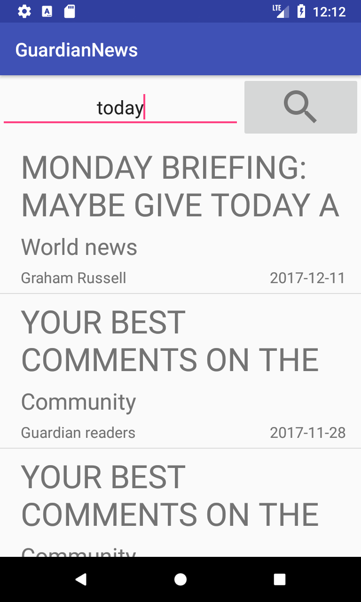

# App made for Android Basics by Google Nanodegree Program

# Layout

CRITERIA

Main Screen

List Item Contents

Layout Best Practices

MEETS SPECIFICATIONS

App contains a main screen which displays multiple news stories

Each list item on the main screen displays relevant text and information about the story.

Required fields include the title of the article and the name of the section that it belongs to.

If available, author name and date published should be included. Please note not all responses will contain these pieces of data, but it is required to include them if they are present.

The code adheres to all of the following best practices:

Text sizes are defined in sp
Lengths are defined in dp
Padding and margin is used appropriately, such that the views are not crammed up against each other.

# Functionality

CRITERIA

Main Screen Updates

Errors

Story Intents

API Query

Use of Loaders

External Libraries and Packages

MEETS SPECIFICATIONS

Stories shown on the main screen update properly whenever new news data is fetched from the API.

The code runs without errors.

Clicking on a story opens the story in the user’s browser.

App queries the content.guardianapis.com api to fetch news stories related to the topic chosen by the student, using either the ‘test’ api key or the student’s key.

Networking operations are done using a Loader rather than an AsyncTask.

The intent of this project is to give you practice writing raw Java code using the necessary classes provided by the Android framework; therefore, the use of external libraries for the core functionality will not be permitted to complete this project.

# Code Readability

CRITERIA

Readability

Naming Conventions

Formatting

MEETS SPECIFICATIONS

Code is easily readable such that a fellow programmer can understand the purpose of the app.

All variables, methods, and resource IDs are descriptively named such that another developer reading the code can easily understand their function.

The code is properly formatted i.e. there are no unnecessary blank lines; there are no unused variables or methods; there is no commented out code.
The code also has proper indentation when defining variables and methods.
